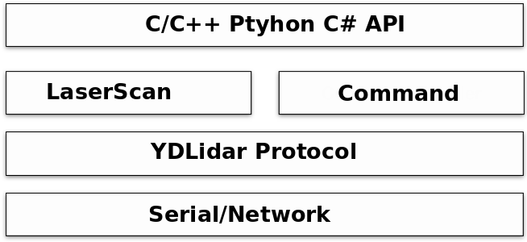

# Table of Contents

1. [Table of Contents](#table-of-contents)
2. [Introduction](#introduction)
    - [Prerequisites](#prerequisites)
    - [Supported Languages](#supported-languages)
3. [YDLidar SDK Communication Protocol](#ydlidar-sdk-communication-protocol)
4. [Architecture](#architecture)
5. [Installation](#installation)
6. [Documents](#documents)
7. [Support](#support)
8. [Contact EAI](#contact-eai)

# Introduction

YDLidar SDK is the software development kit designed for all YDLIDAR products. It is developed based on C/C++ following YDLidar SDK Communication Protocol, and provides easy-to-use C/C++, Python, C# style API. With YDLidar SDK, users can quickly connect to YDLidar products and receive Laser scan data.

YDLidar SDK consists of YDLidar SDK communication protocol, YDLidar SDK core, YDLidar SDK API, Linux/windows samples, and Python demo.

### Prerequisites
* Linux
* Windows 7/10, Visual Studio 2015/2017(UTF-8 encoding)
* C++11 compiler

### Supported Languages
* C / C++
* Python
* C#

## YDLidar SDK Communication Protocol
YDLidar SDK communication protocol opens to all users. It is the communication protocol between user programs and YDLIDAR products. The protocol consists of control commands and data format. Please refer to the [YDLidar SDK Communication Protocol](doc/YDLidar-SDK-Communication-Protocol.md) for detailed information.

## Architecture

YDLidar SDK provides the implementation of control commands and Laser scan data transmission, as well as the C/C++,Python API. The basic structure of YDLidar SDK is shown as below:

 Serial or network is used for communication between YDLidar SDK and LiDAR sensors. Please refer to the YDLidar SDK Communication Protocol for further information. LaserScan supports Laser Scan Data transmission, while Command handler receives and sends control commands. And the C++ API is based on Command and LaserScan Hander.

The YDLidar LiDAR sensors can be connected to host directly by serial or through the YDLidar Adapter board. YDLidar SDK supports both connection methods. When LiDAR units are connected to host directly by Serial, the host will establish communication with each LiDAR unit individually. And if the LiDAR units connect to host through Adapter board, then the host only communicates with the YDLidar Adapter board while the Adapter Board communicates with each LiDAR unit.

## Installation

* [Fork and then Clone YDLidar-SDK's GitHub code](https://github.com/YDLIDAR/YDLidar-SDK) 

* [Build and Install](doc/howto/how_to_build_and_install.md) - This step is required

## Documents
* [LiDAR Dataset](doc/Dataset.md): All you need to know about LiDAR Models.

* [SDK FlowChart](doc/Diagram.md): Development flowchart.

* [YDLIDAR SDK API for Developers](doc/YDLIDAR_SDK_API_for_Developers.md): All you need to know about YDLiDAR-SDK API

* [YDLIDAR SDK Communication Protocol](doc/YDLidar-SDK-Communication-Protocol.md): All you need to know about YDLiDAR-SDK Communication Protocol.

* [HowTo](doc/howto/README.md): Brief technical solutions to common problems that developers face during the installation and use of the YDLidar-SDk 

* [Tutorials](doc/Tutorials.md): Quick Tutorials

* [FAQs](doc/FAQs/README.md) 

## Support

You can get support from YDLidar with the following methods:
* Send email to support@ydlidar.com with a clear description of your problem and your setup
* Github Issues

## Contact EAI

If you have any extra questions, please feel free to [contact us](http://www.ydlidar.cn/cn/contact)
